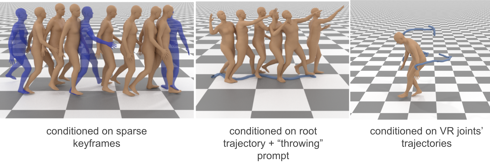
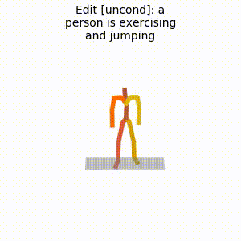

# Flexible Motion In-betweening with Diffusion Models

[](https://arxiv.org/abs/2405.11126)

The official PyTorch implementation of the paper [**"Flexible Motion In-betweening with Diffusion Models"**](https://arxiv.org/pdf/2405.11126).

For more details, visit our [**project page**](https://setarehc.github.io/CondMDI/).



## News
📢
**21/June/24** - First release.


### Bibtex
If you find this code useful in your research, please cite:

```
@article{cohan2024flexible,
  title={Flexible Motion In-betweening with Diffusion Models},
  author={Cohan, Setareh and Tevet, Guy and Reda, Daniele and Peng, Xue Bin and van de Panne, Michiel},
  journal={arXiv preprint arXiv:2405.11126},
  year={2024}
}
```


## Getting started

This code was developed on `Ubuntu 20.04 LTS` with Python 3.7, CUDA 11.7 and PyTorch 1.13.1.


### 1. Setup environment
Install ffmpeg (if not already installed):

```shell
sudo apt update
sudo apt install ffmpeg
```
For windows use [this](https://www.geeksforgeeks.org/how-to-install-ffmpeg-on-windows/) instead.


### 2. Install dependencies
This codebase shares a large part of its base dependencies with [GMD](https://github.com/korrawe/guided-motion-diffusion). We recommend installing our dependencies from scratch to avoid version differences.

Setup virtual env:
```shell
python3 -m venv .env_condmdi
source .env_condmdi/bin/activate
pip uninstall ffmpeg
pip install spacy
python -m spacy download en_core_web_sm
pip install git+https://github.com/openai/CLIP.git
```

Download dependencies:

<details>
  <summary><b>Text to Motion</b></summary>

```bash
bash prepare/download_smpl_files.sh
bash prepare/download_glove.sh
bash prepare/download_t2m_evaluators.sh
```
</details>

<details>
  <summary><b>Unconstrained</b></summary>

```bash
bash prepare/download_smpl_files.sh
bash prepare/download_recognition_unconstrained_models.sh
```
</details>

### 2. Get data
There are two paths to get the data:

(a) **Generation only** wtih pretrained text-to-motion model without training or evaluating

(b) **Get full data** to train and evaluate the model.


#### a. Generation only (text only)

**HumanML3D** - Clone HumanML3D, then copy the data dir to our repository:

```shell
cd ..
git clone https://github.com/EricGuo5513/HumanML3D.git
unzip ./HumanML3D/HumanML3D/texts.zip -d ./HumanML3D/HumanML3D/
cp -r HumanML3D/HumanML3D diffusion-motion-inbetweening/dataset/HumanML3D
cd diffusion-motion-inbetweening
cp -a dataset/HumanML3D_abs/. dataset/HumanML3D/
```


#### b. Full data (text + motion capture)

**[Important !]**
Following GMD, the representation of the root joint has been changed from relative to absolute. Therefore, you need to replace the original files and run GMD's version of `motion_representation.ipynb` and `cal_mean_variance.ipynb` provided in `./HumanML3D_abs/` instead to get the absolute-root data.

**HumanML3D** - Follow the instructions in [HumanML3D](https://github.com/EricGuo5513/HumanML3D.git),
then copy the result dataset to our repository:

```shell
cp -r ../HumanML3D/HumanML3D ./dataset/HumanML3D
```

### 3. Download the pretrained models

Download the model(s) you wish to use, then unzip and place them in `./save/`.

Our models are all trained on the HumanML3D dataset.

[Conditionally trained on randomly sampled frames](https://drive.google.com/file/d/15mYPp2U0VamWfu1SnwCukUUHczY9RPIP/view?usp=sharing)

[Unconditionally (no keyframes) trained](https://drive.google.com/file/d/1B0PYpmCXXwV0a5mhkgea_J2pOwhYy-k5/view?usp=sharing)


## Motion Synthesis
<details>
  <summary><b>Text to Motion - <u>Without</u> spatial conditioning</b></summary>

This part is a standard text-to-motion generation.

### Generate from test set prompts
#### using the unconditioned model
```shell
python -m sample.synthesize --model_path ./save/condmdi_uncond/model000500000.pt --num_samples 10 --num_repetitions 3
```
#### using the conditional model
```shell
python -m sample.conditional_synthesis --model_path ./save/condmdi_randomframes/model000750000.pt --edit_mode uncond --num_samples 10 --num_repetitions 3
```
* You can use `--no_text` to sample from the conditional model without text conditioning.

### Generate from a single prompt
#### using the unconditioned model
```shell
python -m sample.synthesize --model_path ./save/condmdi_uncond/model000500000.pt --num_samples 10 --num_repetitions 1 --text_prompt "a person is exercising and jumping"
```
#### using the conditional model
```shell
python -m sample.conditional_synthesis --model_path ./save/condmdi_randomframes/model000750000.pt --edit_mode uncond --num_samples 10 --num_repetitions 3 --text_prompt "a person is exercising and jumping"
```

</details>

<details>
  <summary><b>Text to Motion - <u>With</u> keyframe conditioning</b></summary>

### Generate from a single prompt - condition on keyframe locations
#### using the uncoditioned model
```shell
python -m sample.edit --model_path ./save/condmdi_uncond/model000500000.pt --edit_mode benchmark_sparse --transition_length 5 --num_samples 10 --num_repetitions 3 --imputate --stop_imputation_at 1 --reconstruction_guidance --reconstruction_weight 20 --text_condition "a person throws a ball"
```
* You can remove `--text_condition` to generate samples conditioned only on keyframes (not text).
#### using the conditional model
```shell
python -m sample.conditional_synthesis --model_path ./save/condmdi_randomframes/model000750000.pt --edit_mode benchmark_sparse --transition_length 5 --num_samples 10 --num_repetitions 3 --text_prompt "a person throws a ball"
```

### Generate from test set prompts - condition on keyframe locations
#### using the conditional model
```shell
python -m sample.conditional_synthesis --model_path ./save/condmdi_randomframes/model000750000.pt --edit_mode benchmark_sparse --transition_length 5 --num_samples 10 --num_repetitions 3
```
* You can use `--no_text` to sample from the conditional model without text conditioning.

(In development) Using the `--interactive` flag will start an interactive window that allows you to choose the keyframes yourself. The interactive pattern will override the predefined pattern.


**Useful flags for spatial conditioning:**
* `--edit_mode` to indicate the type of spatial condition.
* `--imputation` to use imputation/inpainting for inference-time conditioning.
    * `stop_imputation_at` to indicate the diffusion step to stop replacement. Default is 0.
* `--reconstruction_guidance` to use reconstruction guidance for inference-time conditioning.
    * `--reconstruction_weight` to indicate the reconstruction guidance weight ($w_r$ in Algorithm 3)
</details>

**You may also define:**
* `--device` id.
* `--seed` to sample different prompts.
* `--motion_length` (text-to-motion only) in seconds (maximum is 9.8[sec]).
* `--progress` to save the denosing progress.

**Running those will get you:**
* `results.npy` file with text prompts and xyz positions of the generated animation
* `sample##_rep##.mp4` - a stick figure animation for each generated motion.
You can stop here, or render the SMPL mesh using the following script.

### Render SMPL mesh

To create SMPL mesh per frame run:

```shell
python -m visualize.render_mesh --input_path /path/to/mp4/stick/figure/file
```

**This script outputs:**
* `sample##_rep##_smpl_params.npy` - SMPL parameters (thetas, root translations, vertices and faces)
* `sample##_rep##_obj` - Mesh per frame in `.obj` format.

**Notes:**
* The `.obj` can be integrated into Blender/Maya/3DS-MAX and rendered using them.
* This script is running [SMPLify](https://smplify.is.tue.mpg.de/) and needs GPU as well (can be specified with the `--device` flag).
* **Important** - Do not change the original `.mp4` path before running the script.

**Notes for 3d makers:**
* You have two ways to animate the sequence:
  1. Use the [SMPL add-on](https://smpl.is.tue.mpg.de/index.html) and the theta parameters saved to `sample##_rep##_smpl_params.npy` (we always use beta=0 and the gender-neutral model).
  1. A more straightforward way is using the mesh data itself. All meshes have the same topology (SMPL), so you just need to keyframe vertex locations.
     Since the OBJs are not preserving vertices order, we also save this data to the `sample##_rep##_smpl_params.npy` file for your convenience.


## Training

Our model is trained on the **HumanML3D** dataset.
### Conditional Model
```shell
python -m train.train_condmdi --keyframe_conditioned
```
* You can ramove `--keyframe_conditioned` to train a unconditioned model.
* Use `--device` to define GPU id.

## Evaluate
All evaluation are done on the HumanML3D dataset.

### Text to Motion - <u>With</u> keyframe conditioning

* Takes about 20 hours (on a single GPU)
* The output of this script for the pre-trained models (as was reported in the paper) is provided in the checkpoints zip file.
* For each prompt, 5 keyframes are sampled from the ground truth motion. The ground locations of the root joint in those frames are used as conditions.

#### on the unconditioned model
```shell
python -m eval.eval_humanml_condmdi --model_path ./save/condmdi_uncond/model000500000.pt --edit_mode gmd_keyframes --imputate --stop_imputation_at 1
```
* Above prompt evaluates the inference-time imputation for keyframe conditioning.

#### on the conditional model
```shell
python -m eval.eval_humanml_condmdi --model_path ./save/condmdi_randomframes/model000750000.pt --edit_mode gmd_keyframes --keyframe_guidance_param 1.
```


## Acknowledgments

We would like to thank the following contributors for the great foundation that we build upon:
[GMD](https://github.com/korrawe/guided-motion-diffusionhttps://github.com/korrawe/guided-motion-diffusion), [MDM](https://github.com/GuyTevet/motion-diffusion-model), [guided-diffusion](https://github.com/openai/guided-diffusion), [MotionCLIP](https://github.com/GuyTevet/MotionCLIP), [text-to-motion](https://github.com/EricGuo5513/text-to-motion), [actor](https://github.com/Mathux/ACTOR), [joints2smpl](https://github.com/wangsen1312/joints2smpl), [MoDi](https://github.com/sigal-raab/MoDi).

## License
This code is distributed under an [MIT LICENSE](LICENSE).

Note that our code depends on other libraries, including CLIP, SMPL, SMPL-X, PyTorch3D, and uses datasets that each have their own respective licenses that must also be followed.